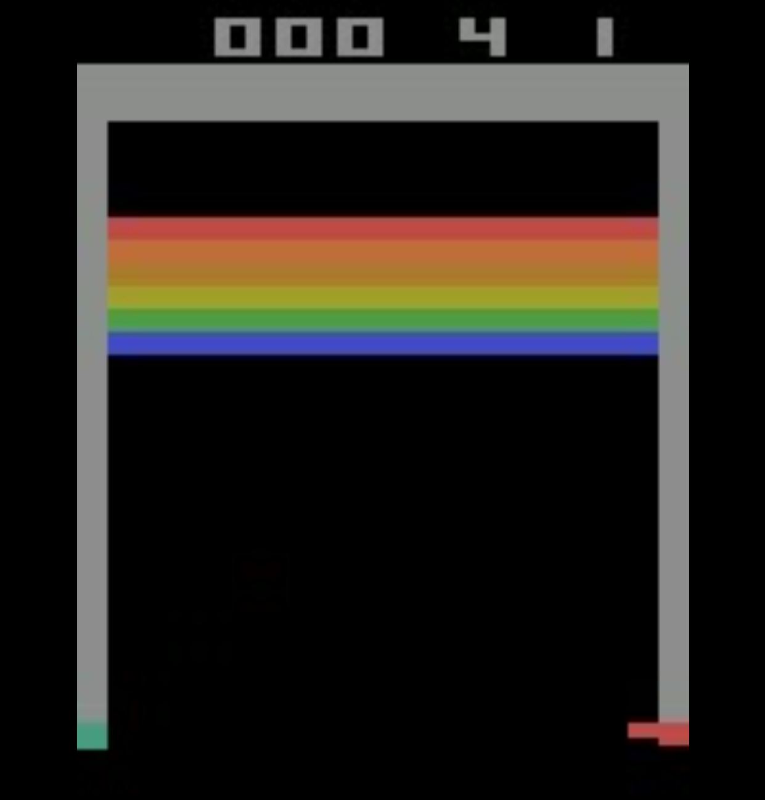
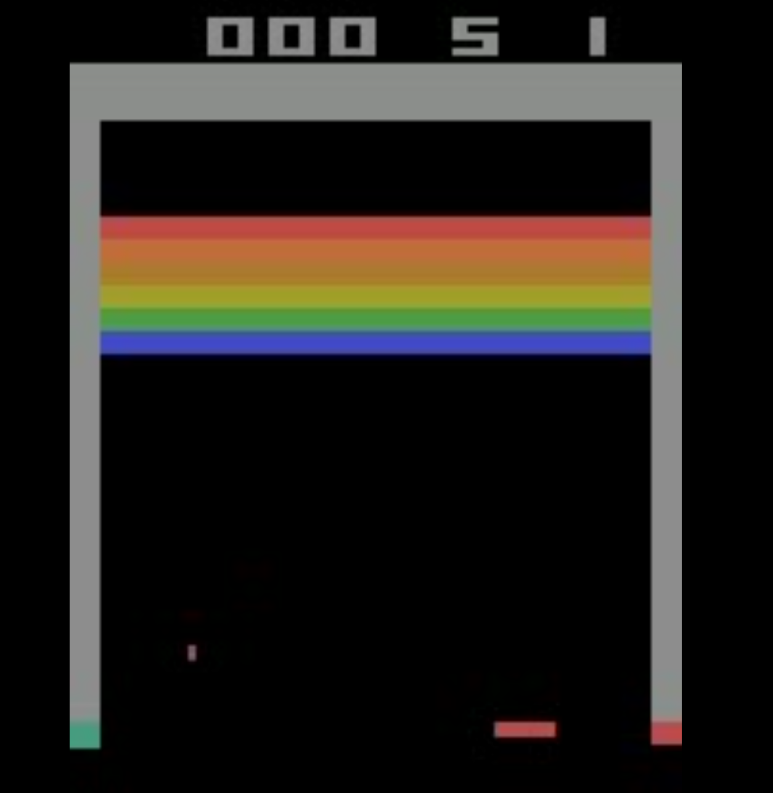

# Fall 2025

## ALE Breakout V5

[Breakout Docs](https://ale.farama.org/environments/breakout/)

## 🎮 DQN Breakout Agent Evaluation

Watch how performance improves as training progresses:

| Episode | Model | Preview | Video |
|---------|--------|---------|--------|
| First   | `ALE_Breakout-v5-best_0-20250928-1852-Qbert_test_epsdec10000_rs1000_sync500`  |  | <a href="https://github.com/MiguelIbarra2021/CSCI-166/blob/655c78538d7626981382ceef80ad5e4b684d7df0/ALE_Breakout-v5_first_model.mp4" target="_blank">▶ Watch</a> |
| Last    | `ALE_Breakout-v5-best_4-20250928-1941-Qbert_test_epsdec10000_rs1000_sync500`  |  | <a href="https://github.com/MiguelIbarra2021/CSCI-166/blob/655c78538d7626981382ceef80ad5e4b684d7df0/ALE_Breakout-v5_last_model.mp4" target="_blank">▶ Watch</a> 
